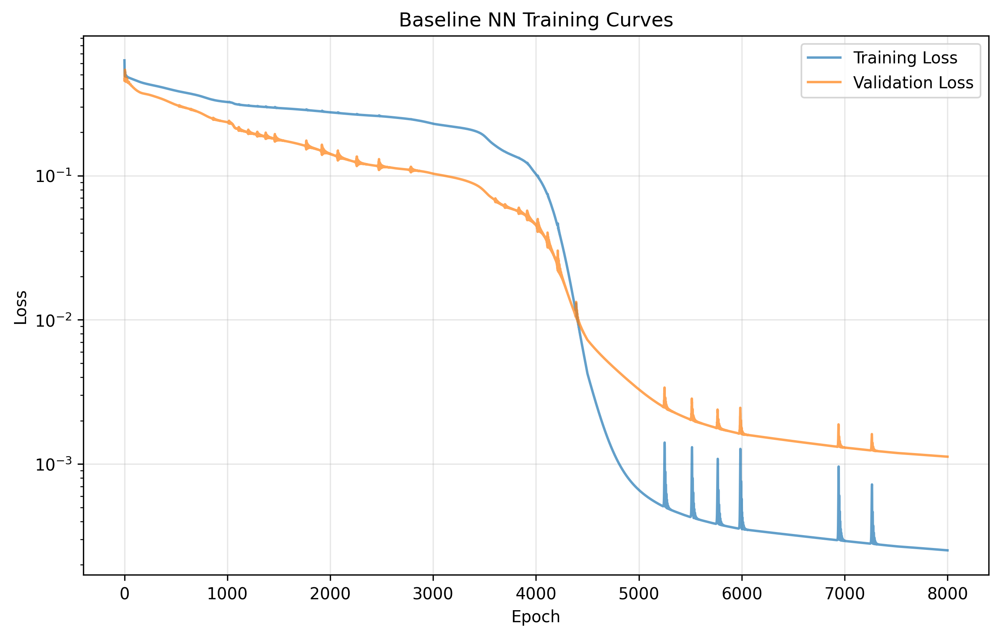
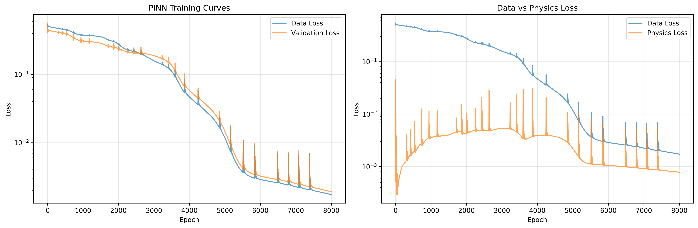
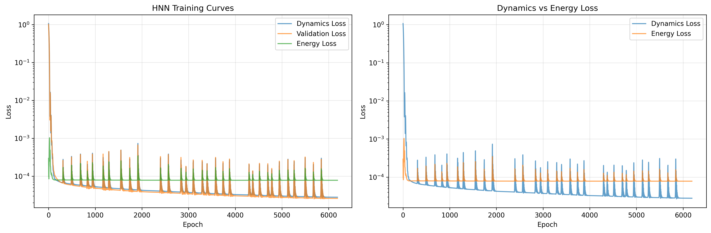
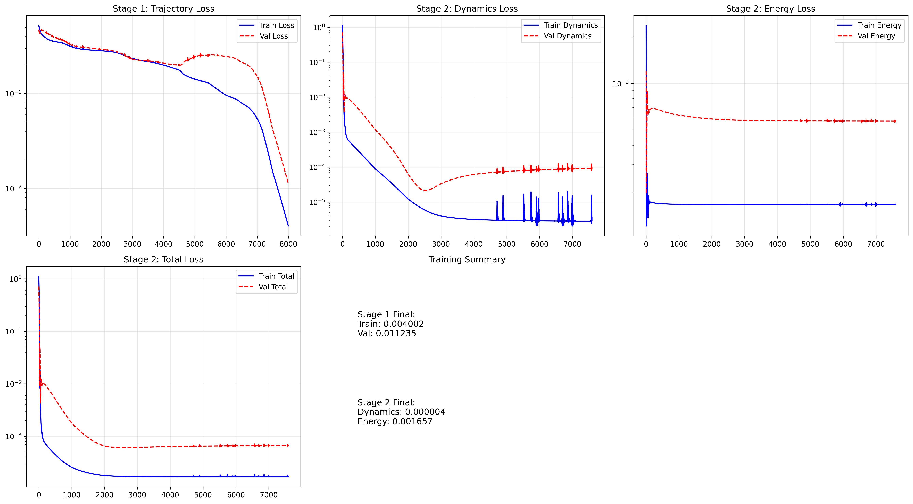
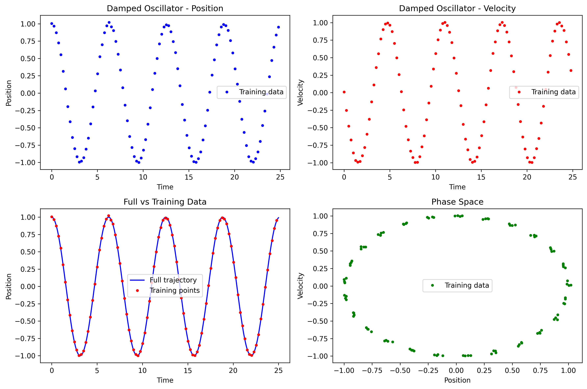
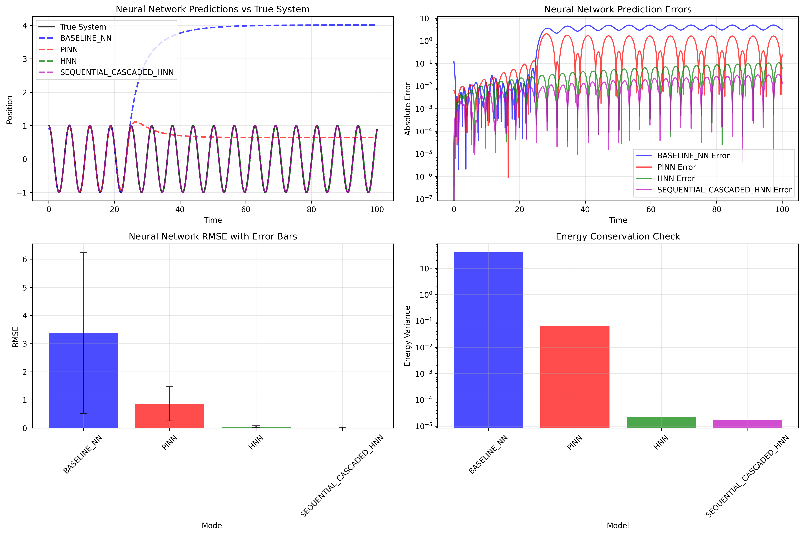
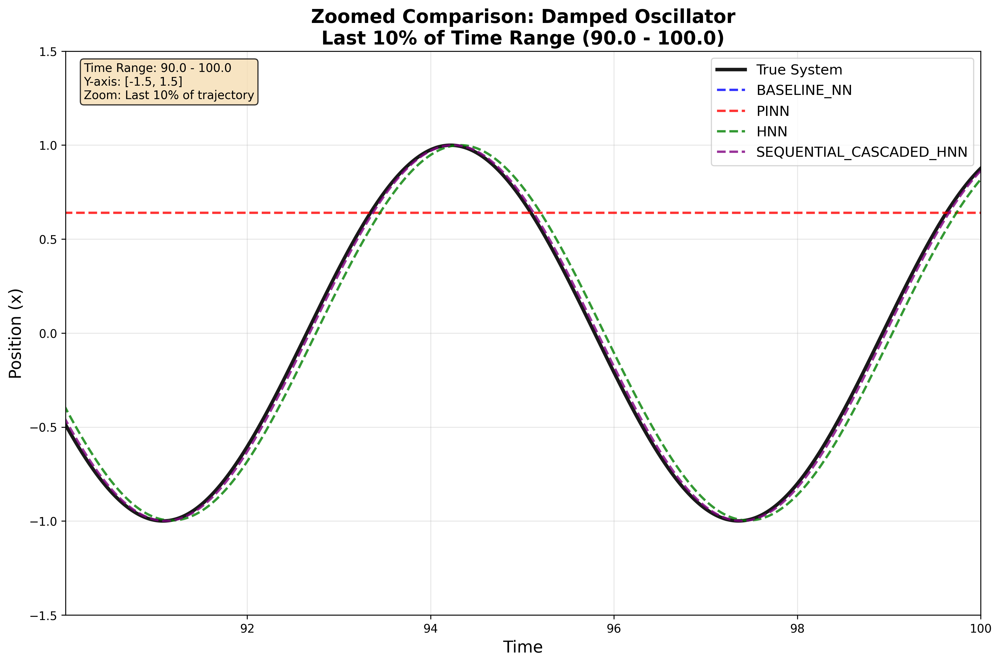

# AI Safety and Physics: Neural Networks for Equation Discovery

This project implements a comprehensive pipeline for comparing different neural network approaches to learning physics and extracting interpretable equations. The goal is to understand how different inductive biases affect the long-term stability and interpretability of learned dynamical systems.

## Project Overview

The project compares multiple neural network approaches:

1. **Baseline Neural Network**: Standard neural network that fits data without physics constraints
2. **Physics-Informed Neural Network (PINN)**: Incorporates physics constraints into the loss function
3. **Hamiltonian Neural Network (HNN)**: Learns a Hamiltonian function and enforces energy conservation
4. **Sequential Cascaded HNN**: Two-stage training (trajectory first, then HNN)

## Key Research Questions

- How do different inductive biases affect long-term stability?
- Which approach yields the most interpretable discovered equations?
- Do physics-informed models lead to better symbolic regression results?
- How does energy conservation affect equation discovery?

## Generated Visualizations

The pipeline generates comprehensive visualizations to analyze model performance and training dynamics:

### Training Plots

#### 1. Baseline Neural Network Training

- **File**: `plots/baseline_nn_training.png`
- **Description**: Training and validation loss curves for the baseline neural network
- **Shows**: Learning progress, overfitting detection, convergence behavior
- **Key Metrics**: Train/validation loss over epochs

#### 2. PINN Training

- **File**: `plots/pinn_training.png`
- **Description**: Training curves for Physics-Informed Neural Network
- **Shows**: Combined loss (data + physics), individual loss components
- **Key Metrics**: Data loss, physics loss, total loss over training

#### 3. HNN Training

- **File**: `plots/hnn_training.png`
- **Description**: Training curves for Hamiltonian Neural Network
- **Shows**: Dynamics loss, energy conservation loss, total loss
- **Key Metrics**: Energy variance, dynamics accuracy, convergence

#### 4. Sequential Cascaded HNN Training

- **File**: `plots/sequential_cascaded_hnn_training.png`
- **Description**: Two-stage training curves for sequential cascaded HNN
- **Shows**: Stage 1 (trajectory) and Stage 2 (HNN) training separately
- **Key Metrics**: Stage-wise convergence, cascaded learning effectiveness

### Data and Validation Plots

#### 5. Generated Data Visualization

- **File**: `plots/damped_oscillator_data.png`
- **Description**: Visualization of generated synthetic data for the damped oscillator
- **Shows**: Position vs time, velocity vs time, phase space
- **Key Metrics**: Data quality, noise levels, sampling density

#### 6. Long-term Comparison

- **File**: `plots/long_term_comparison_damped_oscillator.png`
- **Description**: Comprehensive long-term validation comparison
- **Shows**: 
  - True system vs neural network predictions
  - RMSE error bars for each model
  - Energy conservation check
  - Metrics comparison across models
- **Key Metrics**: Long-term stability, energy conservation, prediction accuracy

#### 7. Zoomed Comparison

- **File**: `plots/zoomed_comparison_damped_oscillator.png`
- **Description**: Detailed zoomed-in view of neural network predictions
- **Shows**: Last 10% of trajectory with y-limits [-1.5, 1.5]
- **Key Metrics**: Fine-grained prediction accuracy, detailed error analysis

## Project Structure

```
apart_hamiltonian/
├── data_generation.py          # Synthetic data generation
├── models/
│   ├── nn_baseline.py         # Baseline neural network
│   ├── pinn.py                # Physics-Informed Neural Network
│   ├── hnn.py                 # Hamiltonian Neural Network
│   └── sequential_cascaded_hnn.py # Sequential cascaded HNN
├── regression/
│   └── symbolic_regression.py # PySINDy-based equation discovery
├── validation/
│   └── compare_long_term.py   # Long-term dynamics comparison
├── main.py                    # Complete pipeline execution
├── requirements.txt           # Dependencies
├── plots/                     # Generated visualizations
└── README.md                 # This file
```

## Installation

1. Clone the repository:
```bash
git clone https://github.com/armandyam/hnn_pinn_sindy
cd apart_hamiltonian
```

2. Set up virtual environment and install dependencies:
```bash
./setup_venv.sh
```

This will:
- Create a Python virtual environment
- Install all required dependencies
- Create necessary project directories

3. Activate the virtual environment:
```bash
source venv/bin/activate
```

Or use the convenience script:
```bash
./activate.sh
```

## Usage

### Full Test 
```bash
source venv/bin/activate
python main.py test
```
This runs the complete pipeline with the damped harmonic oscillator system.

### Using the convenience script
```bash
./activate.sh python main.py test
```

### Individual Steps

You can also run individual components:

1. **Data Generation**:
```bash
source venv/bin/activate
python data_generation.py
```

2. **Train Individual Models**:
```bash
source venv/bin/activate
python models/nn_baseline.py
python models/pinn.py
python models/hnn.py
python models/sequential_cascaded_hnn.py
```

3. **Symbolic Regression**:
```bash
source venv/bin/activate
python regression/symbolic_regression.py
```

4. **Long-term Validation**:
```bash
source venv/bin/activate
python validation/compare_long_term.py
```

Or using the convenience script:
```bash
./activate.sh python data_generation.py
./activate.sh python models/nn_baseline.py
./activate.sh python models/pinn.py
./activate.sh python models/hnn.py
./activate.sh python models/sequential_cascaded_hnn.py
./activate.sh python regression/symbolic_regression.py
./activate.sh python validation/compare_long_term.py
```

## Methodology

### Step 1: Data Generation
- Generate synthetic data for damped harmonic oscillator
- Add noise and subsample to simulate real-world constraints
- Save data to CSV files for training

### Step 2: Neural Network Training
- **Baseline NN**: Standard regression network trained on position vs time
- **PINN**: Incorporates physics constraints (second-order ODE form)
- **HNN**: Learns Hamiltonian H(q,p) and enforces energy conservation
- **Sequential Cascaded HNN**: Two-stage training (trajectory first, then HNN)

### Step 3: Long-term Validation
- Integrate discovered equations forward in time
- Compare with true system dynamics
- Analyze stability, energy conservation, and error growth

## System Studied

### Damped Harmonic Oscillator
- **True Equation**: `ẍ + 0.1ẋ + x = 0`
- **State Variables**: Position x, Velocity ẋ
- **Characteristics**: Linear, damped, good for comparing conservation and stability

## Expected Results

### Long-term Stability
- **Baseline NN**: Likely to show energy drift and instability
- **PINN**: Should show improved stability due to physics constraints
- **HNN**: Should maintain energy conservation over long times
- **Sequential Cascaded HNN**: Should leverage two-stage learning for better performance


### Interpretability
- HNN-based equations should be more interpretable and physically plausible
- PINN should provide a good balance between accuracy and interpretability
- Baseline NN may provide accurate short-term predictions but poor interpretability
- Sequential cascaded model should offer enhanced interpretability through multi-stage learning

## Output Files

The pipeline generates several output directories:

- `data/`: Generated datasets (CSV files)
- `models/saved/`: Trained neural network models
- `results/`: Symbolic regression results (JSON files)
- `plots/`: Visualization plots (PNG files)

## Key Metrics

1. **RMSE**: Root Mean Square Error vs true trajectory
2. **Energy Variance**: Measure of energy conservation
3. **Equation Complexity**: Number of terms in discovered equations
4. **Long-term Stability**: Error growth over extended time periods
5. **Training Convergence**: Loss curves and early stopping behavior
6. **Stage-wise Performance**: For cascaded models, performance at each stage

## Dependencies

- **PyTorch**: Neural network training
- **SciPy**: ODE integration and numerical methods
- **PySINDy**: Symbolic regression
- **Matplotlib**: Visualization
- **NumPy/Pandas**: Data manipulation

## Contributing

This project is designed for research in AI safety and physics. Contributions are welcome, particularly:

- Additional physical systems
- New neural network architectures
- Enhanced validation metrics
- Generalization of system based on Hamiltonian

## License

[Add your license information here]

## Contact

[Add contact information] 